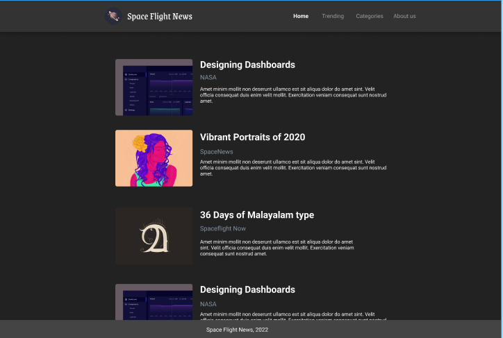

# Space Flight News  


  

## Sobre o Projeto  

**Space Flight News** é uma landing page desenvolvida em React para exibir notícias sobre o universo e tecnologia espacial. O design prioriza a simplicidade e a usabilidade, permitindo aos usuários explorarem conteúdos, listagem de notícias com título, autor e descrição breve.

---

## Tecnologias Utilizadas  

- **React**: Framework utilizado para construção da interface.  
- **CSS**: Todo o design e layout foram implementados utilizando estilos diretamente no arquivo `styles.css`.  

---

## Como Executar o Projeto  

1. Clone o repositório:  
   ```bash
   git clone https://github.com/gabrielabade/space-flight-news.git
2. Acesse o diretório do projeto:
    ```bash
   cd space-flight-news
3. Instale as dependências:
    ```bash
   npm install
4. Execute o projeto em ambiente de desenvolvimento:
    ```bash
    npm start
O projeto estará disponível em http://localhost:3000.

